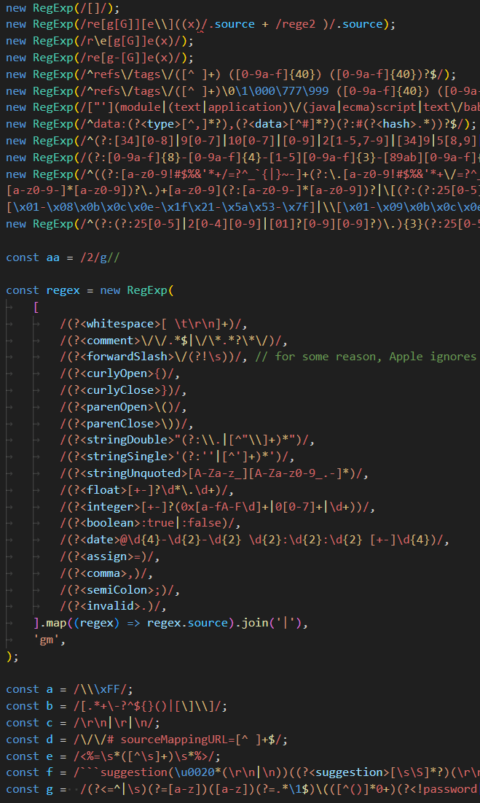
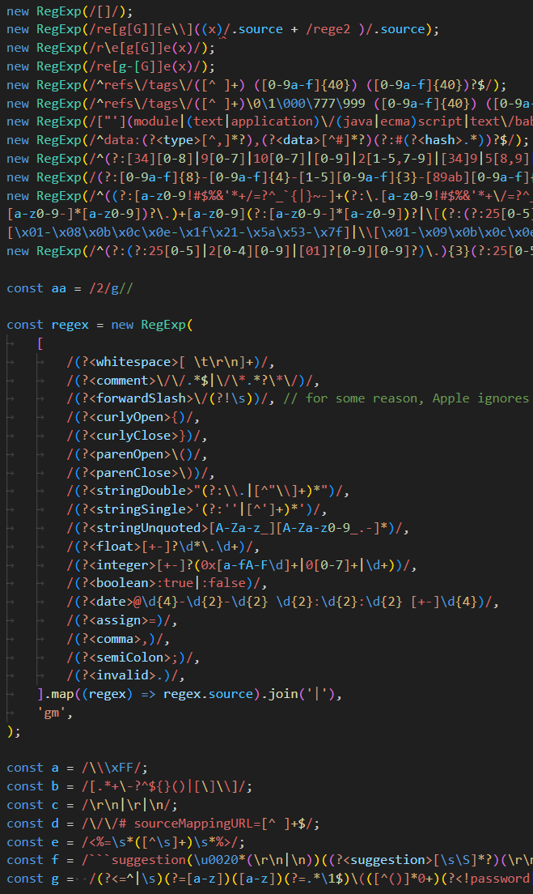

# regex-syntax-highlighter-vscode
VSCode extension for Regular Expressions syntax highlighting for different languages  

## Features
* Fixes old bugs
* Adds missing syntax's
* Improves scopeNames
* Colourized bracket pair matching

## JavaScript/TypeScript

Before:  |  After:
:--------:|:--------:
  |  

## For more information
* The GitHub Issues that spawned the idea
  * [Parenthesis and brace matching within RegExps](https://github.com/microsoft/vscode/issues/148612)
  * [Bracket pair colorization in regexes](https://github.com/microsoft/vscode/issues/134560)
* Github [repo](https://github.com/RedCMD/regex-syntax-highlighter-vscode)
* Marketplace [extension](https://marketplace.visualstudio.com/items?itemName=RedCMD.regexp-syntax-highlighter)
